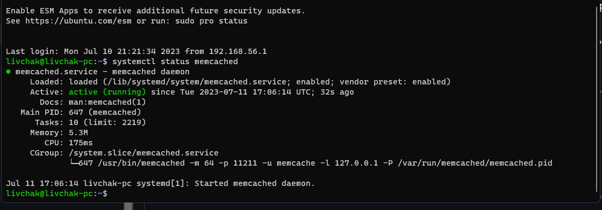
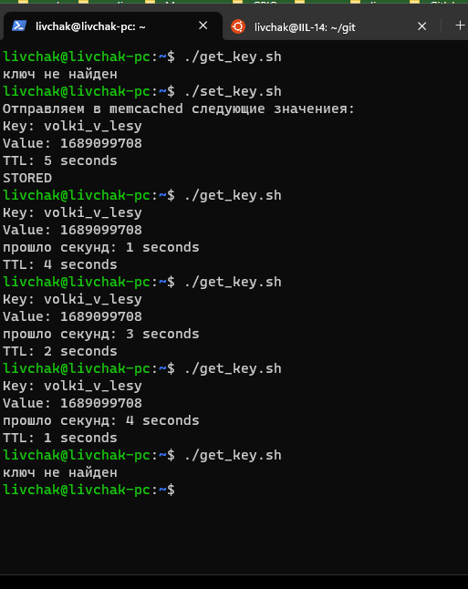
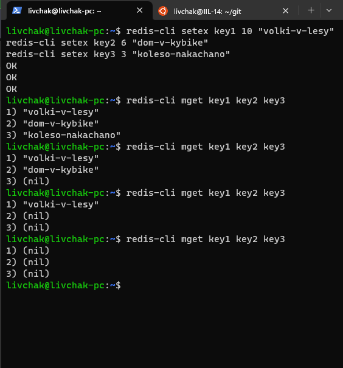
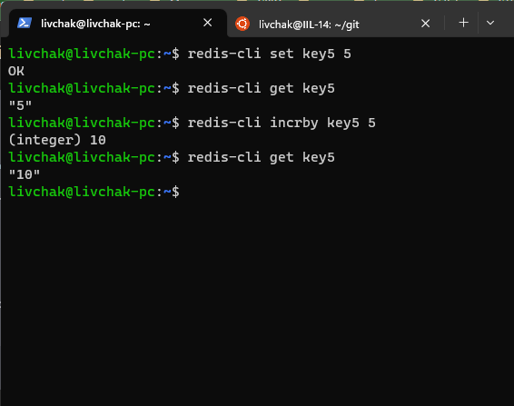

# Домашнее задание к занятию "`11-02hw`" - `Ливчак Сергей`


---

### Задание 1

`Приведите примеры проблем, которые может решить кеширование`

1. HTTP кеширование - может выполняться как на клиентском уровне (кеширование браузером веб контента, при этом браузер сам решает когда очищать кеш и так же инструкции по сроку хранения кеша могут содержаться в http заголовках) так и на стороне сервера (прокси серверы кешируют как правило согласно заголовкам кеширования http или согласно своим правилам)
2. CDN кеширование - или сеть распределённых географически серверов предназначенные для ускорения загрузки контента конечным клиентам 
3. DNS кеширование - преобразование имен сайтов в ip адреса позволяет не выполнять запросы к глобальному серверу, а сразу отправиться по нужному ip адресу просто использовав локальный кеш при условии что ttl такого кеша не закончился.
4. Кеш процессора - локально расположенная на процессоре память, которая в  случае попадания обеспечивает значительно более быстрый доступ к данным чем оперативная память.
5. Кеширование запросов в базу данных. Логика работы примерно такая же - взять данные из ближайшего источника (кеша) и недостающие запросить запросить в самой базе данных с диска. К примеру нам нужно выполнить транзакцию которая обращается к большому количеству строк. Часть операций мы выполняем с кешем (запрос статических данных), за остальными данными идём на диск в базу данных. 

---

### Задание 2

`Установите и запустите memcached.`

**Скриншот 2-1_1** 


---

### Задание 3

`Запишите в memcached несколько ключей с любыми именами и значениями, для которых выставлен TTL 5.`

**Скриншот 3-1_1** 


```
<details>
  <summary>cat set_key.sh</summary>

#!/bin/bash

# устанавливаем ключ, значение и время жизни (TTL)
key="volki_v_lesy"
value=$(date +%s)
ttl=5

# выводим значения перед отправкой их в Memcached
echo "Отправляем в memcached следующие значениея:"
echo "Key: $key"
echo "Value: $value"
echo "TTL: $ttl seconds"

# подключаемся к серверу Memcached и устанавливаем ключ и значение
echo -e "set $key 0 $ttl ${#value}\r\n$value\r\nquit" | nc localhost 11211

</details>

<details>
  <summary>cat get_key.sh</summary>

#!/bin/bash

# получаем ключ
key="volki_v_lesy"

# подключаемся к серверу Memcached и получаем значение ключа
value=$(echo -e "get $key\r\nquit" | nc localhost 11211 | awk 'NR==2 {print $1; exit}' | tr -dc '0-9')

if [ -n "$value" ]; then
    # вычисляем сколько времени прошло и оставшееся время жизни
    current_time=$(date +%s)
    key_time=$value
#    elapsed_time=$((key_time - current_time))
    elapsed_time=$((current_time - key_time))
    remaining_ttl=$((5 - elapsed_time))

    echo "Key: $key"
    echo "Value: $key_time"
    echo "прошло секунд: $elapsed_time seconds"
    echo "TTL: $remaining_ttl seconds"
else
    echo "ключ не найден"
fi

</details>

```

### Задание 4

`Запишите в Redis несколько ключей с любыми именами и значениями.`

**Скриншот 4-1_1** 


---
## Дополнительные задания (со звездочкой*)

Эти задания дополнительные (не обязательные к выполнению) и никак не повлияют на получение вами зачета по этому домашнему заданию. Вы можете их выполнить, если хотите глубже и/или шире разобраться в материале.

### Задание 5

`Запишите в Redis ключ key5 со значением типа "int" равным числу 5. Увеличьте его на 5, чтобы в итоге в значении лежало число 10.`

**Скриншот 5-1_1** 

